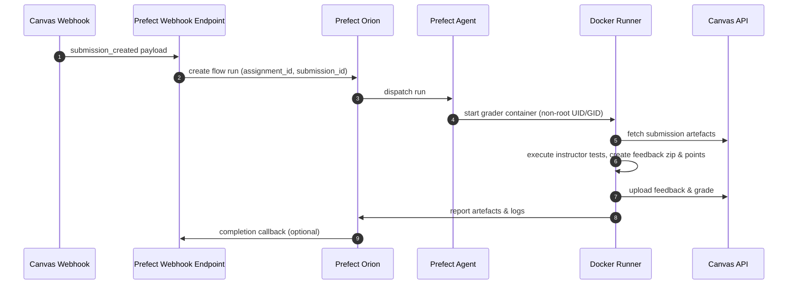
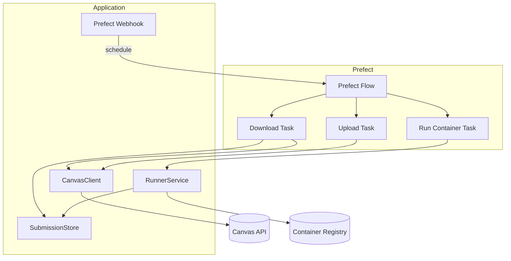

# Architecture Overview

The v2 rewrite replaces the original bash pipeline with a Prefect-first
architecture that keeps the system modular, testable, and secure by default.

## Component Responsibilities

- **Prefect Flow** – coordinates the download, execution, upload, and reporting
  tasks. Runs entirely locally via Prefect Orion/agent.
- **CanvasClient** – encapsulates Canvas API access (download submissions,
  upload comments, post grades) with retries and structured logging.
- **Runner** – executes student submissions inside a Docker container derived
  from the provided template using a non-root UID/GID, memory/CPU limits, and
  optionally network isolation.
- **Submission Store** – temporary workspace on the host (or object storage)
  used to exchange artefacts with the runner.
- **Prefect Webhook** – Canvas events call Prefect's native webhook endpoint,
  which queues a flow run without additional services. Optional custom shims can
  be added later only if advanced preprocessing is required.

## Prefect Flow (UML Sequence)

## Component Diagram

## Data Flow Stages

1. **Schedule** – Canvas webhook or CLI call triggers a Prefect flow run with
   assignment/submission identifiers.
2. **Download** – CanvasClient fetches the submission attachment(s) into an
   isolated workspace (or object storage). Metadata persists alongside artefacts
   for traceability.
3. **Execute** – Runner launches the grader Docker image using a non-root user,
   network isolation, and resource quotas. Feedback artefacts are generated
   in-place.
4. **Collect** – Prefect captures stdout/stderr, collects the feedback zip,
   points, and logs, and stores them for inspection.
5. **Upload** – Feedback and grades are pushed back to Canvas idempotently (md5
   and filename checks). Failures trigger Prefect retries.

## Security Considerations

- Every container run uses an unprivileged UID/GID configurable in settings; the
  Dockerfile ensures ownership alignment for mounted volumes.
- Network is disabled by default unless explicitly required for dependencies.
- Canvas API tokens are stored using Prefect blocks or environment
  variables—never committed to the repository.
- Project defaults target reproducibility: `uv` manages dependencies, Prefect
  logs provide run transparency, and MkDocs records design updates.
