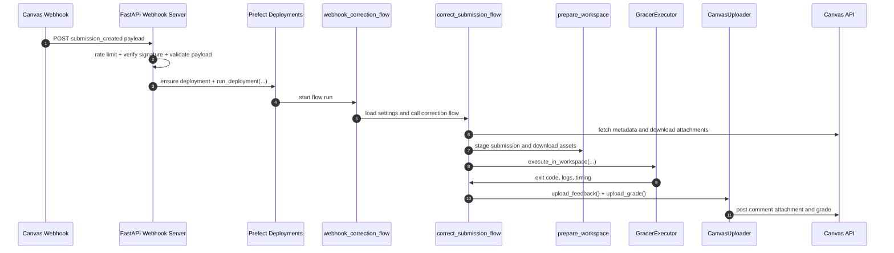
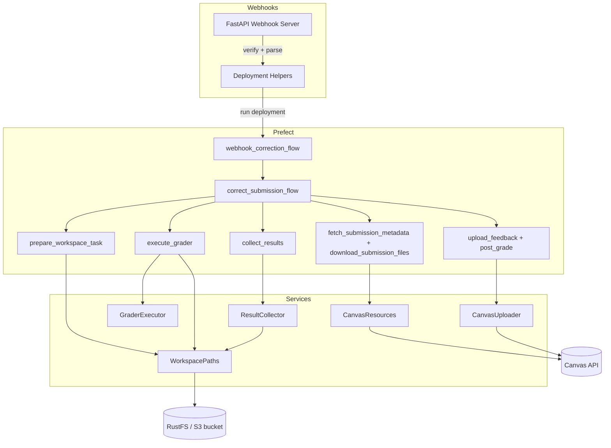

# Architecture Overview

**Canvas Code Correction v2** replaces the original bash pipeline with a
Prefect‑first architecture that keeps the system modular, testable, and secure
by default.

## Design Goals

- **Modularity** – Each component has a single, well‑defined responsibility and
  communicates through explicit interfaces.
- **Testability** – Services can be unit‑tested in isolation; integration tests
  verify the end‑to‑end pipeline.
- **Security** – Grader containers run as unprivileged users, network is
  disabled by default, and secrets are managed via Prefect blocks.
- **Operational Simplicity** – Prefect handles scheduling, retries, logging, and
  monitoring; you only need to define the grading logic.

## Component Responsibilities

- **Prefect Flows** – `webhook_correction_flow` loads course settings and
  dispatches `correct_submission_flow`, which coordinates metadata fetch,
  download, workspace preparation, grader execution, result collection, and
  Canvas uploads.
- **CanvasResources** – Bundles the `canvasapi.Canvas` client, resolved course,
  and application settings so Prefect tasks share a consistent Canvas context.
- **GraderExecutor** – Runs the instructor‑provided command inside Docker using
  a dedicated workspace and explicit resource limits.
- **Grader Configuration Blocks** – Prefect configuration blocks store course‑specific
  grader images, resource limits, commands, and environment variables. Course
  blocks store the target work pool name; operators create and manage the
  matching Prefect work pools and workers separately.
- **ResultCollector** – Extracts `points.txt`, `comments.txt`, artefacts, and
  metadata produced by the grader and prepares zipped feedback for upload.
- **CanvasUploader** – Posts comments and grades back to Canvas while skipping
  duplicate attachments.
- **Submission Workspace** – `prepare_workspace` creates a transient run
  directory, stages submission attachments, and downloads grader assets before
  execution begins.
- **Asset Storage (RustFS)** – S3‑compatible object storage for immutable grader
  assets (tests, fixtures, helper scripts). Configurable via environment
  variables for local development and production deployments.
- **FastAPI Webhook Server** – Canvas events hit a FastAPI endpoint that rate
  limits requests, verifies webhook signatures, validates payloads, and triggers
  Prefect deployments.

## New Services (Phase 2)

The following services were implemented as part of Phase 2 to complete the
Canvas client migration:

- **GraderExecutor** (`canvas_code_correction.runner`) – Docker‑based grader
  execution with resource limits, container management, timeout handling, and
  workspace mounting. Provides a secure execution environment with non‑root
  users, network isolation, and configurable resource constraints.
- **ResultCollector** (`canvas_code_correction.collector`) – Parses grader
  outputs (`points.txt`, `comments.txt`), creates feedback zip archives,
  validates results, and collects grading artefacts. Supports various
  points‑file formats and robust error handling.
- **CanvasUploader** (`canvas_code_correction.uploader`) – Idempotent Canvas
  feedback and grade uploads with MD5 duplicate detection. Handles both comment
  attachments and grade posting with configurable duplicate checking and dry‑run
  modes.

These services are now integrated into the Prefect flow via the
`execute_grader`, `collect_results`, `upload_feedback`, and `post_grade` tasks,
completing the end‑to‑end correction pipeline.

## Prefect Flow Sequence

The following diagram illustrates the current webhook-to-grading path.

**Step‑by‑step explanation**

1. **Webhook trigger** – Canvas sends a `submission_created` or
   `submission_updated` payload to the FastAPI webhook server.
2. **Validation** – The server rate limits the request, verifies the Canvas
   signature, and validates the JSON payload.
3. **Deployment launch** – The webhook handler ensures the course deployment
   exists and starts `webhook_correction_flow` through Prefect.
4. **Flow handoff** – `webhook_correction_flow` loads course settings and calls
   `correct_submission_flow` with the assignment and submission identifiers.
5. **Download** – The correction flow fetches submission metadata and downloads
   attachment files from the Canvas API.
6. **Workspace prep** – `prepare_workspace` copies submission files into a run
   directory and pulls grader assets from the configured S3-compatible bucket.
7. **Execution and collection** – `GraderExecutor` runs the grader command, then
   `ResultCollector` assembles feedback, points, and artefact metadata.
8. **Upload** – `CanvasUploader` posts the feedback zip and grade back to
   Canvas.

## Component Diagram

The diagram below shows the main architectural components and their
relationships.

**Key interactions**

- The **FastAPI Webhook Server** validates Canvas requests and asks Prefect to
  launch the per-course deployment.
- `webhook_correction_flow` acts as the bridge between webhook-triggered runs
  and the main correction flow.
- The fetch tasks use **CanvasResources** to retrieve submission metadata and
  download attachment files from the **Canvas API**.
- `prepare_workspace_task` materializes **WorkspacePaths**, copies the
  submission, and downloads grader assets from **RustFS / S3**.
- `execute_grader`, `collect_results`, and the upload tasks delegate to
  **GraderExecutor**, **ResultCollector**, and **CanvasUploader** respectively.

## Data Flow Stages

1. **Schedule** – A Canvas webhook or CLI call triggers a Prefect flow run with
   assignment and submission identifiers.
2. **Download** – **CanvasResources** retrieves submission metadata and
   attachment files from Canvas into a run-specific download directory.
3. **Prepare workspace** – `prepare_workspace` creates isolated directories,
   copies the downloaded submission, and materializes grader assets from the
   configured S3-compatible bucket.
4. **Execute** – `GraderExecutor` bind-mounts the submission and assets into a
   Docker container with resource limits, network isolation, and a read-only
   root filesystem.
5. **Collect** – `ResultCollector` parses `points.txt`, `comments.txt`, and
   artefacts, then builds the feedback zip for upload.
6. **Upload** – `CanvasUploader` posts feedback and grades back to Canvas
   idempotently using duplicate checks. Failures surface through Prefect.

## Security Considerations

- **Unprivileged containers** – Each grader container can run as an
  unprivileged UID/GID and is removed after execution. Submission files live in
  a per-run workspace that is bind-mounted into the container.
- **Network isolation** – Network is disabled by default unless explicitly
  required for dependencies.
- **Secret management** – Canvas API tokens are stored using Prefect blocks or
  environment variables. Never committed to the repository.
- **Reproducibility** – Project defaults target reproducibility: `uv` manages
  dependencies, Prefect logs provide run transparency, and MkDocs records design
  updates.

## Next Steps

- To configure a course, see [Configuration](03-configuration.md).
- For CLI usage, refer to [Command‑Line Interface](02-cli.md).
- Details on writing grader tests are in
  [Authoring Grader Tests](06-authoring-grader-tests.md).
