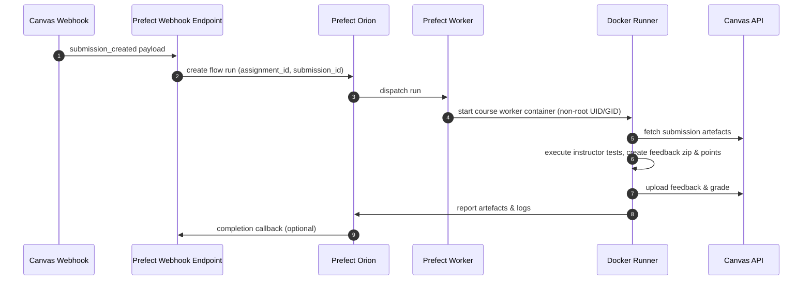
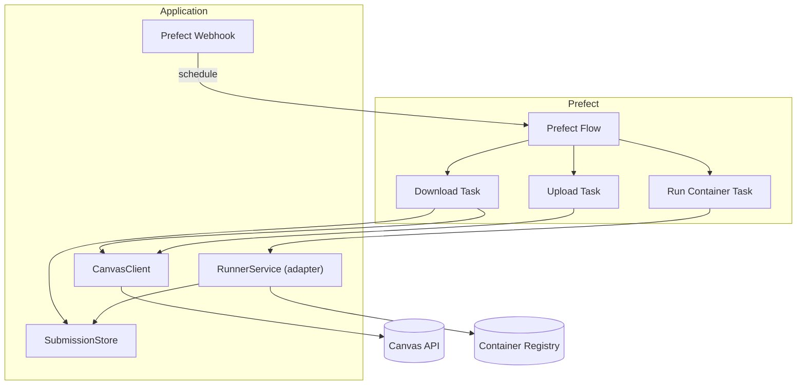

# Architecture Overview

**Canvas Code Correction v2** replaces the original bash pipeline with a
Prefect‑first architecture that keeps the system modular, testable, and secure
by default.

## Design Goals

- **Modularity** – Each component has a single, well‑defined responsibility and
  communicates through explicit interfaces.
- **Testability** – Services can be unit‑tested in isolation; integration tests
  verify the end‑to‑end pipeline.
- **Security** – Grader containers run as unprivileged users, network is
  disabled by default, and secrets are managed via Prefect blocks.
- **Operational Simplicity** – Prefect handles scheduling, retries, logging, and
  monitoring; you only need to define the grading logic.

## Component Responsibilities

- **Prefect Flow** – Coordinates the download, execution, upload, and reporting
  tasks. Runs entirely locally via the Prefect Orion/worker.
- **CanvasClient** – Encapsulates Canvas API access (download submissions,
  upload comments, post grades) with automatic retries and structured logging.
- **Grader Executor** – Runs the instructor‑provided command inside a
  Prefect‑managed worker container using a dedicated workspace. No nested Docker
  is required.
- **Grader Configuration Blocks** – Prefect configuration blocks store course‑specific
  grader images, resource limits, per‑assignment commands, and environment
  variables. Each course provisions a dedicated Prefect Docker work pool bound
  to its grader image.
- **Result Collector** – Extracts `points.txt`, `comments.txt`, artefacts, and
  metadata produced by the grader and prepares zipped feedback for upload.
- **Uploader** – Posts comments and grades back to Canvas while skipping
  duplicate attachments.
- **Submission Workspace** – A transient directory inside the worker container
  where submission attachments are staged and grader artefacts are produced.
- **Asset Storage (RustFS)** – S3‑compatible object storage for immutable grader
  assets (tests, fixtures, helper scripts). Configurable via environment
  variables for local development and production deployments.
- **Prefect Webhook** – Canvas events call Prefect’s native webhook endpoint,
  which queues a flow run without additional services. Optional custom shims can
  be added later only if advanced preprocessing is required.

## New Services (Phase 2)

The following services were implemented as part of Phase 2 to complete the
Canvas client migration:

- **GraderExecutor** (`canvas_code_correction.runner`) – Docker‑based grader
  execution with resource limits, container management, timeout handling, and
  workspace mounting. Provides a secure execution environment with non‑root
  users, network isolation, and configurable resource constraints.
- **ResultCollector** (`canvas_code_correction.collector`) – Parses grader
  outputs (`points.txt`, `comments.txt`), creates feedback zip archives,
  validates results, and collects grading artefacts. Supports various
  points‑file formats and robust error handling.
- **CanvasUploader** (`canvas_code_correction.uploader`) – Idempotent Canvas
  feedback and grade uploads with MD5 duplicate detection. Handles both comment
  attachments and grade posting with configurable duplicate checking and dry‑run
  modes.

These services are now integrated into the Prefect flow via the
`execute_grader`, `collect_results`, `upload_feedback`, and `post_grade` tasks,
completing the end‑to‑end correction pipeline.

## Prefect Flow Sequence

The following diagram illustrates the sequence of events when a Canvas webhook
triggers a grading run.

**Step‑by‑step explanation**

1. **Webhook trigger** – Canvas sends a `submission_created` payload to the
   Prefect webhook endpoint.
2. **Flow creation** – The endpoint creates a Prefect flow run with the
   assignment and submission identifiers.
3. **Worker dispatch** – Prefect dispatches the run to a worker that matches the
   course’s Docker work pool.
4. **Container start** – The worker starts a course‑specific container running
   as an unprivileged user.
5. **Download** – The container fetches the submission artefacts from the Canvas
   API.
6. **Execution** – The grader command runs inside the container, producing a
   feedback zip and a points file.
7. **Upload** – The container uploads the feedback and grade back to Canvas.
8. **Reporting** – The container reports artefacts and logs to Prefect; an
   optional completion callback can be sent to the webhook endpoint.

## Component Diagram

The diagram below shows the main architectural components and their
relationships.

**Key interactions**

- The **Prefect Webhook** schedules the **Prefect Flow** when a Canvas
  submission is created.
- The **Download Task** uses the **CanvasClient** to fetch submissions and
  stores them in the **SubmissionStore**.
- The **Run Container Task** calls the **RunnerService** adapter, which pulls
  the course‑specific grader image from the **Container Registry** and executes
  it with the staged submission.
- The **Upload Task** again uses the **CanvasClient** to post feedback and
  grades back to the **Canvas API**.

## Data Flow Stages

1. **Schedule** – A Canvas webhook or CLI call triggers a Prefect flow run with
   assignment and submission identifiers.
2. **Download** – The **CanvasClient** fetches the submission attachment(s) into
   an isolated workspace (or object storage). Metadata persists alongside
   artefacts for traceability.
3. **Execute** – Prefect starts a course‑specific Docker worker container
   (non‑root UID/GID, resource quotas) and invokes the grader command directly
   inside the container. All artefacts stay within the container filesystem.
4. **Collect** – Prefect captures stdout/stderr, collects the feedback zip,
   points, and logs, and stores them for inspection.
5. **Upload** – Feedback and grades are pushed back to Canvas idempotently (MD5
   and filename checks). Failures trigger Prefect retries.

## Security Considerations

- **Unprivileged containers** – Each worker container runs as an unprivileged
  UID/GID baked into the base grader image. The filesystem vanishes when the
  container exits, so no submissions persist on the host.
- **Network isolation** – Network is disabled by default unless explicitly
  required for dependencies.
- **Secret management** – Canvas API tokens are stored using Prefect blocks or
  environment variables. Never committed to the repository.
- **Reproducibility** – Project defaults target reproducibility: `uv` manages
  dependencies, Prefect logs provide run transparency, and MkDocs records design
  updates.

## Next Steps

- To configure a course, see [Configuration](03-configuration.md).
- For CLI usage, refer to [Command‑Line Interface](02-cli.md).
- Details on writing grader tests are in
  [Authoring Grader Tests](06-authoring-grader-tests.md).
