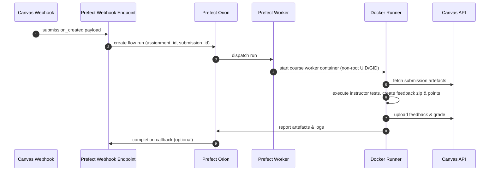
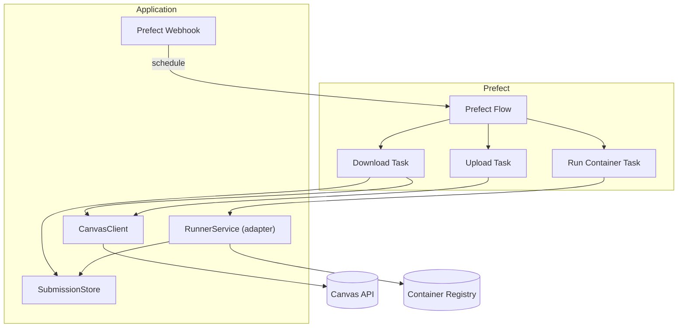

# Architecture Overview

The v2 rewrite replaces the original bash pipeline with a Prefect-first
architecture that keeps the system modular, testable, and secure by default.

## Component Responsibilities

- **Prefect Flow** – coordinates the download, execution, upload, and reporting
  tasks. Runs entirely locally via Prefect Orion/worker.
- **CanvasClient** – encapsulates Canvas API access (download submissions,
  upload comments, post grades) with retries and structured logging.
- **Grader Executor** – runs the instructor-provided command inside the
  Prefect-managed worker container using a dedicated workspace (no nested Docker
  required). Legacy integrations call the thin `RunnerService` adapter, which
  simply delegates to the executor.
- **Grader Configuration Blocks** – Prefect JSON blocks capture course-specific
  grader images, resource limits, per-assignment commands, and environment
  variables so each course can bring its own grading environment without
  modifying the shared codebase. Each course provisions a dedicated Prefect
  Docker work pool bound to its grader image.
- **Result Collector** – extracts `points.txt`, `comments.txt`, artefacts, and
  metadata produced by the grader and prepares zipped feedback for upload.
- **Uploader** – posts comments and grades back to Canvas while skipping
  duplicate attachments.
- **Submission Workspace** – transient directory inside the worker container
  where submission attachments are staged and grader artefacts are produced.
- **Asset Storage (RustFS)** – S3-compatible object storage for immutable grader
  assets (tests, fixtures, helper scripts). Configurable via environment
  variables for local development and production deployments.
- **Prefect Webhook** – Canvas events call Prefect's native webhook endpoint,
  which queues a flow run without additional services. Optional custom shims can
  be added later only if advanced preprocessing is required.

## New Services (Phase 2)

The following services were implemented as part of Phase 2 to complete the
Canvas client migration:

- **GraderExecutor** (`canvas_code_correction.runner`) – Docker-based grader
  execution with resource limits, container management, timeout handling, and
  workspace mounting. It provides a secure execution environment with non-root
  users, network isolation, and configurable resource constraints.

- **ResultCollector** (`canvas_code_correction.collector`) – Parses grader
  outputs (`points.txt`, `comments.txt`), creates feedback zip archives,
  validates results, and collects grading artefacts. Supports various points
  file formats and robust error handling.

- **CanvasUploader** (`canvas_code_correction.uploader`) – Idempotent Canvas
  feedback and grade uploads with MD5 duplicate detection. Handles both comment
  attachments and grade posting with configurable duplicate checking and dry-run
  modes.

These services are now integrated into the Prefect flow via the
`execute_grader`, `collect_results`, `upload_feedback`, and `post_grade` tasks,
completing the end-to-end correction pipeline.

## Prefect Flow (UML Sequence)

## Component Diagram

## Data Flow Stages

1. **Schedule** – Canvas webhook or CLI call triggers a Prefect flow run with
   assignment/submission identifiers.
2. **Download** – CanvasClient fetches the submission attachment(s) into an
   isolated workspace (or object storage). Metadata persists alongside artefacts
   for traceability.
3. **Execute** – Prefect starts a course-specific Docker worker container
   (non-root UID/GID, resource quotas) and invokes the grader command directly
   inside the container. All artefacts stay within the container filesystem.
4. **Collect** – Prefect captures stdout/stderr, collects the feedback zip,
   points, and logs, and stores them for inspection.
5. **Upload** – Feedback and grades are pushed back to Canvas idempotently (md5
   and filename checks). Failures trigger Prefect retries.

## Security Considerations

- Each worker container runs as an unprivileged UID/GID baked into the base
  grader image. The filesystem vanishes when the container exits, so no
  submissions persist on the host.
- Network is disabled by default unless explicitly required for dependencies.
- Canvas API tokens are stored using Prefect blocks or environment
  variables—never committed to the repository.
- Project defaults target reproducibility: `uv` manages dependencies, Prefect
  logs provide run transparency, and MkDocs records design updates.
